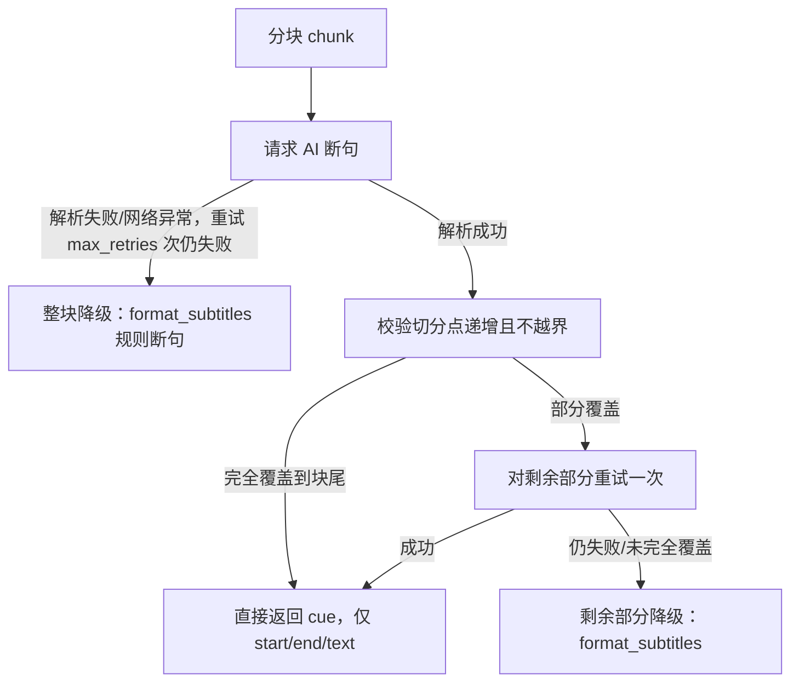

# AI 断句模式：设计与实现

## 背景

[docs/subtitle-segment-analysis.md](./subtitle-segment-analysis.md) 分析了现有规则断句（[app/subtitle/segment.py](../app/subtitle/segment.py)）的固有短板，核心是：**规则断句依赖标点/静音/词数等表层信号，无法理解语义**。其中影响面最大的是 YouTube 自动生成（ASR）字幕通常没有标点，导致断句几乎只能靠静音时长和硬性词数上限，容易在语义中间生硬切分。

对比调研了 kiss-translator（`D:\fork\kiss-translator`）的 AI 字幕断句实现（`src/subtitle/youtubeAiSegmentation.js` + `src/config/api.js` 的 `defaultSubtitlePrompt`），结论：**规则断句应保留为默认/兜底路径（零成本、确定性、无需联网），但可以引入一个可选的 AI 断句模式，专门解决语义理解类的短板**。

实现分两个阶段：第一版把断句和翻译合并成一次请求（模型同时返回原文+译文），实测发现 token 消耗和耗时都远超预期；第二版（当前版本）把协议瘦身为"只让模型返回切分点"，翻译交还给已有的批量翻译流程，大幅降低了成本和延迟。下面记录的是当前版本的设计。

## 核心设计

### 1. 协议：只要切分点，不要模型复述原文/给译文

时间戳和原文永远由本模块基于原始词级 `flat_events` 重建，**不信任模型自己报告的时间或文本，也不需要模型输出文本**。模型只需要回答"在哪些词 id 处结束一个片段"：

```json
[8, 14, 22, 33]
```

`8` 表示第一个片段覆盖 id `0-8`，`14` 表示第二个片段覆盖 `9-14`，以此类推——单次请求的生成量从"整段原文+译文"降到几个整数，token 和耗时大幅下降。

第一版协议（`{"e","o","t"}`，模型要复述原文并顺带给译文）已废弃，原因见下面的"迭代记录"。

### 2. 结构校验 + 自动降级，失败上限就是现状

每个分块的处理流程（`_process_chunk`）：



校验规则（`_build_cues_from_cutpoints`）：切分点必须从上一段 `+1` 开始、严格递增、不越界；只要有一步失败，就在该点截断，剩余部分自动走现有规则断句兜底，**永远不会比现在的规则断句结果更差**。

不再做"模型复述原文是否逐字一致"的内容校验——这是用可靠性换速度的权衡，见下方"已知限制"。

### 3. 分块策略复用现有断句信号

`chunk_events` 按目标字符数（默认 **3000**，因为输出不再受长度拖累，可以用更大的块减少 system prompt 重复发送次数）分块，达到 80% 预期边界后，优先在句末标点（复用 `segment.py` 的 `_END_OF_SENTENCE_RE`）或静音 >1s 处切，减少语义被硬切在分块边界的概率。

### 4. 翻译解耦：统一交给已有的批量翻译

AI 断句的返回结果只有 `{start, end, text}`，不含译文。调用方（server.py / cli.py）无需再区分"AI 已翻译/待翻译"两种 cue，直接对全部结果统一跑一次：

```python
cues = ai_format_subtitles(...) if ai_segment else format_subtitles(...)
if translate:
    translate_cues(cues, ...)
```

这比第一版更简单：不再需要过滤 `"translation" not in c`，代码路径和"不开 AI 断句"时完全一致。

### 5. 并发与复用

- `ai_format_subtitles` 分块之间互不依赖，用 `ThreadPoolExecutor + as_completed` 并发处理（默认 `concurrency=8`，复用 [app/tts.py](../app/tts.py) 已验证过的模式）；`translate_cues` 同样加了 `concurrency`（默认 4）。
- 重构 [app/translate.py](../app/translate.py) 抽出 `resolve_call_llm` 工厂，AI 断句与 `translate_cues` 共用同一份 HTTP 请求实现。JSON 解析也复用 `translate.py` 里已有的 `_strip_code_fence` / `_try_json_array`。

## 模块结构

[app/subtitle/ai_segment.py](../app/subtitle/ai_segment.py)：

| 函数                         | 职责                                                            |
| ---------------------------- | --------------------------------------------------------------- |
| `chunk_events`               | 按字符数分块，优先在句末标点/静音处切                           |
| `build_indexed_events`       | 词级事件 → `[{"id","text","pauseMs"?}]`                         |
| `build_ai_segment_messages`  | 按源语言是否无空格（CJK 等）选用不同长度限制规则                |
| `parse_ai_segments`          | 解析模型响应为切分点整数数组，格式不对返回 `None`               |
| `_build_cues_from_cutpoints` | 校验切分点递增/不越界，产出验证通过的 cue 与覆盖终点            |
| `_process_chunk`             | 单分块处理：请求 → 校验 → 未覆盖部分尾部重试一次 → 规则断句兜底 |
| `ai_format_subtitles`        | 主入口：并发处理各分块 → 按原始顺序拼接结果                     |

`app/subtitle/__init__.py` 导出 `ai_format_subtitles`。

## 接入点（默认关闭，opt-in）

- **[server.py](../app/server.py)**：`PrepareRequest.ai_segment: bool = False`，仅 `translate=True` 时生效；`ai_format_subtitles` 抛 `ValueError`（缺 API Key）时捕获并整体降级为规则断句。
- **[cli.py](../app/cli.py)**：新增 `--ai-segment`，仅 `translated`/`bilingual` 模式下生效，同样捕获 `ValueError` 后降级而不是直接报错退出。
- **前端**（[web/index.html](../web/index.html) / [web/app.js](../web/app.js)）：新增"AI 智能断句"开关，**默认不勾选**（kiss-translator 的同类功能 `segSlug` 默认也是 `"-"` 关闭状态，且它是按播放位置懒加载处理，不像本项目要一次性处理全量视频，默认开着成本明显更高）；未勾选"翻译成中文"时该开关自动禁用并取消勾选。

## 测试

[tests/test_ai_segment.py](../tests/test_ai_segment.py)，沿用 `translate.py` 测试里"注入假 `call_llm`"的模式，覆盖：

- `chunk_events`：字符数硬切、句末标点提前切块。
- `build_indexed_events`：`pauseMs` 计算。
- `build_ai_segment_messages`：空格/无空格语言的长度规则。
- `parse_ai_segments`：合法解析、去 markdown 围栏、整数浮点数容错、非法格式拒绝。
- `ai_format_subtitles` 端到端：完全成功（无 translation 字段）、无空格语言拼接方式、整体解析失败降级、切分点越界降级、部分覆盖+尾部重试成功、部分覆盖+尾部重试仍失败（仅剩余部分降级）、逐块进度回调。

全部 82 个测试通过。

## 迭代记录

1. **第一版（`{"e","o","t"}` 合并断句+翻译）**：实测发现该协议要求模型把原文再复述一遍到 `"o"` 字段用于逐字校验，单次请求的生成量接近纯翻译的 2 倍，导致 token 消耗和耗时都远超预期（用户实测反馈"AI 断句非常慢""token 消耗剧增"）。
2. **对比 kiss-translator 真实用法**：发现它的 AI 断句默认关闭（`segSlug: "-"`），且是按 `preTrans`（默认 90 秒）懒加载处理用户实际观看到的位置，从不会一次性处理整段视频——这是它实际使用中 token 消耗低的真正原因，而不是协议本身更省。yt-localizer 是离线批处理工具，必须一次性处理全量视频，天然无法复用这种"按需处理"的省钱方式。
3. **修复了 cli.py 与 server.py 行为不一致的 bug**：`ai_format_subtitles` 抛 `ValueError` 时 cli.py 原本直接 `return 3` 退出，未按承诺降级为规则断句，已修正为与 server.py 一致。
4. **第二版（当前，纯切分点协议）**：去掉 `"o"`/`"t"`，只留切分点，翻译解耦给 `translate_cues` 统一处理，显著降低单次请求的生成量。同时把并发度从 4 提到 8、`max_chunk_chars` 从 1000 提到 3000，进一步压缩总请求数与墙钟时间。

## 已知限制

1. **缓存命中路径不受益**：`/api/prepare` 命中 manifest 缓存时只复用已缓存的最终 `cues`，不会重新分段（manifest 不缓存词级 `flat_events`），因此对已下载过的视频切换 `ai_segment` 开关不会生效，除非 `force=True` 重新下载。
2. **不再做原文内容校验**：第二版协议不要求模型复述原文，因此无法再检测"模型切分点是否真的对应它想要的边界"（比如少切/多切一个词的轻微偏差），只能做结构校验（递增、不越界、覆盖到底）。这是用可靠性换取大幅降本增速的权衡，出现的偏差通常是"差一两个词"级别，不会像协议不合法那样整段降级。
3. **温度为 0 时尾部重试的边际收益有限**：若模型在首次请求里第一个分段就给出错误结果（`covered_end == -1`），尾部重试会用完全相同的输入再请求一次；`temperature=0.0` 的确定性模型可能返回相同的错误结果。这与 `translate.py` 现有的重试逻辑假设一致（依赖 API 侧非严格确定性/瞬时抖动），不是本次引入的新问题。
