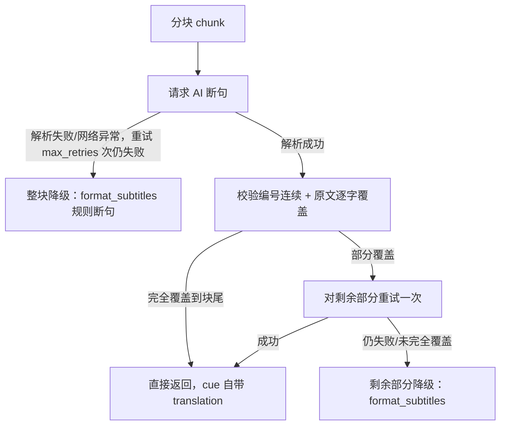

# AI 断句 + 翻译合并模式：设计与实现

## 背景

[docs/subtitle-segment-analysis.md](./subtitle-segment-analysis.md) 分析了现有规则断句（[app/subtitle/segment.py](../app/subtitle/segment.py)）的固有短板，核心是：**规则断句依赖标点/静音/词数等表层信号，无法理解语义**。其中影响面最大的是 YouTube 自动生成（ASR）字幕通常完全没有标点，导致断句几乎只能靠静音时长和硬性词数上限，容易在语义中间生硬切分。

对比调研了 kiss-translator（`D:\fork\kiss-translator`）的 AI 字幕断句实现（`src/subtitle/youtubeAiSegmentation.js` + `src/config/api.js` 的 `defaultSubtitlePrompt`），结论：**规则断句应保留为默认/兜底路径（零成本、确定性、无需联网），但可以引入一个可选的 AI 断句模式，专门解决语义理解类的短板**，且可以和现有翻译调用合并成一次 LLM 请求，不额外增加调用次数。

## 核心设计

### 1. 协议：index-based 边界，而不是模型自报时间戳

时间戳和原文覆盖永远由本模块基于原始词级 `flat_events` 重建，**不信任模型自己报告的时间或文本**。模型只需要回答"在哪个词 id 处结束这一段"：

```json
[
  {
    "e": 8,
    "o": "Once the assets are ready, open the storyboard tab.",
    "t": "素材准备好后，打开故事板标签页。"
  }
]
```

- `e`：该分段最后一个词的输入 id（严格递增，第一段从 id 0 开始覆盖）。
- `o`：模型对该 id 区间原文的逐字合并结果（用于展示，同时也是校验对象）。
- `t`：`o` 的译文，直接写入 `cue["translation"]`，不需要再单独翻译一次。

这个设计移植自 kiss-translator 的 boundary-v3 协议，好处是模型的"幻觉空间"被限制在"选哪个分界点"，而不是要求它精确复述时间戳（时间戳交给程序算，天然更可靠）。

### 2. 严格校验 + 自动降级，失败上限就是现状

每个分块的处理流程（`_process_chunk`）：



校验规则（`_validate_and_build_cues`）：

1. `e` 必须从上一段 `e+1` 开始、严格递增、不越界。
2. 归一化（`ch.isalnum()` 过滤，保留字母数字含 CJK，转小写）后，模型输出的 `o` 必须与该 id 区间原文逐字一致——允许模型修正空格/大小写/标点，但不允许改写、增删、遗漏原文内容。

只要有一步校验失败，就在该点截断，剩余部分自动走现有规则断句兜底，**永远不会比现在的规则断句结果更差**。

### 3. 分块策略复用现有断句信号

`chunk_events` 按目标字符数（默认 1000）分块，达到 80% 预期边界后，优先在句末标点（复用 `segment.py` 的 `_END_OF_SENTENCE_RE`）或静音 >1s 处切，减少语义被硬切在分块边界的概率——这一步复用的是规则断句本身的信号，只是用来选"喂给 AI 的分块边界"，不是最终断句结果。

### 4. 与翻译流程的衔接：不增加 LLM 调用次数

AI 断句成功的 cue 已经自带 `translation` 字段；调用方（server.py / cli.py）只需要：

```python
pending = [c for c in cues if "translation" not in c]
if pending:
    translate_cues(pending, ...)  # 对同一批 dict 的引用原地赋值，天然生效
```

规则断句降级出来的 cue 没有 `translation`，会走原有的批量翻译逻辑；AI 成功的部分不会被重复翻译。这样"断句+翻译"合并成一次调用，相比"规则断句 + 单独翻译"的原有流程，**总 LLM 调用次数不变**。

### 5. 复用而非重复实现

重构 [app/translate.py](../app/translate.py) 抽出 `resolve_call_llm` 工厂（原来内联在 `translate_cues` 里构造默认 DeepSeek `call_llm` 的逻辑），AI 断句模块与 `translate_cues` 共用同一份 HTTP 请求实现，避免复制。JSON 解析也复用 `translate.py` 里已有的 `_strip_code_fence` / `_try_json_array`。

## 模块结构

新增 [app/subtitle/ai_segment.py](../app/subtitle/ai_segment.py)：

| 函数                        | 职责                                                                    |
| --------------------------- | ----------------------------------------------------------------------- |
| `chunk_events`              | 按字符数分块，优先在句末标点/静音处切                                   |
| `build_indexed_events`      | 词级事件 → `[{"id","text","pauseMs"?}]`                                 |
| `build_ai_segment_messages` | 按源语言是否无空格（CJK 等）选用不同长度限制规则，拼装 system/user 消息 |
| `parse_ai_segments`         | 解析模型响应为 `[{"e","o","t"}]`，格式不对返回 `None`                   |
| `_validate_and_build_cues`  | 编号连续性 + 原文覆盖校验，产出验证通过的 cue 与覆盖终点                |
| `_process_chunk`            | 单分块处理：请求 → 校验 → 未覆盖部分尾部重试一次 → 规则断句兜底         |
| `ai_format_subtitles`       | 主入口：分块 → 逐块处理 → 拼接结果                                      |

`app/subtitle/__init__.py` 导出 `ai_format_subtitles`。

## 接入点（默认关闭，opt-in）

- **[server.py](../app/server.py)**：`PrepareRequest.ai_segment: bool = False`，仅 `translate=True` 时生效；`ai_format_subtitles` 抛 `ValueError`（缺 API Key）时捕获并整体降级为规则断句，行为与原有"翻译缺 Key 保留原文+提示"一致。
- **[cli.py](../app/cli.py)**：新增 `--ai-segment`，仅 `translated`/`bilingual` 模式下生效，同样捕获 `ValueError` 后降级（而不是直接报错退出，需要和后续翻译阶段的失败区分开）。
- **前端**（[web/index.html](../web/index.html) / [web/app.js](../web/app.js)）：新增"AI 智能断句"开关，默认不勾选；未勾选"翻译成中文"时该开关自动禁用并取消勾选（AI 断句依赖翻译请求）。

## 测试

[tests/test_ai_segment.py](../tests/test_ai_segment.py)，沿用 `translate.py` 测试里"注入假 `call_llm`"的模式，覆盖：

- `chunk_events`：字符数硬切、句末标点提前切块。
- `build_indexed_events`：`pauseMs` 计算。
- `build_ai_segment_messages`：空格/无空格语言的长度规则、上下文注入。
- `parse_ai_segments`：合法解析、去 markdown 围栏、非法格式/缺字段拒绝。
- `ai_format_subtitles` 端到端：完全成功、整体解析失败降级、原文覆盖不匹配降级、部分覆盖+尾部重试成功、部分覆盖+尾部重试仍失败（仅剩余部分降级）。

全部 80 个测试（含新增 17 个）通过。

## 复查中发现并修复的问题

审查实现时发现 `cli.py` 里 `ai_format_subtitles` 抛出 `ValueError` 时原本直接 `return 3` 退出，没有像 `server.py` 一样降级为规则断句，与 `--ai-segment` 的帮助文案"失败自动降级"承诺不符（两处行为不一致）。已修正为与 `server.py` 一致：捕获后打印警告、降级为规则断句 cue，继续走后续翻译逻辑（如果确实完全没有 API Key，后续 `translate_cues` 仍会因为同样原因失败并返回错误码 3，最终用户可见行为不变，但代码不再自相矛盾）。

## 已知限制

1. **缓存命中路径不受益**：`/api/prepare` 命中 manifest 缓存时只复用已缓存的最终 `cues`，不会重新分段（manifest 不缓存词级 `flat_events`），因此对已下载过的视频切换 `ai_segment` 开关不会生效，除非 `force=True` 重新下载。
2. **温度为 0 时尾部重试的边际收益有限**：若模型在首次请求里第一个分段就给出错误结果（`covered_end == -1`），尾部重试会用完全相同的输入再请求一次；`temperature=0.0` 的确定性模型可能返回相同的错误结果。这与 `translate.py` 现有的重试逻辑假设一致（依赖 API 侧非严格确定性/瞬时抖动），不是本次引入的新问题。
3. **Prompt 注入面扩大**：视频标题/简介作为 `context` 拼进 system prompt，这是 `translate.py` 里已经存在的既有风险模式，AI 断句复用了同样的方式，风险等级未变但作用范围扩大到断句阶段。
