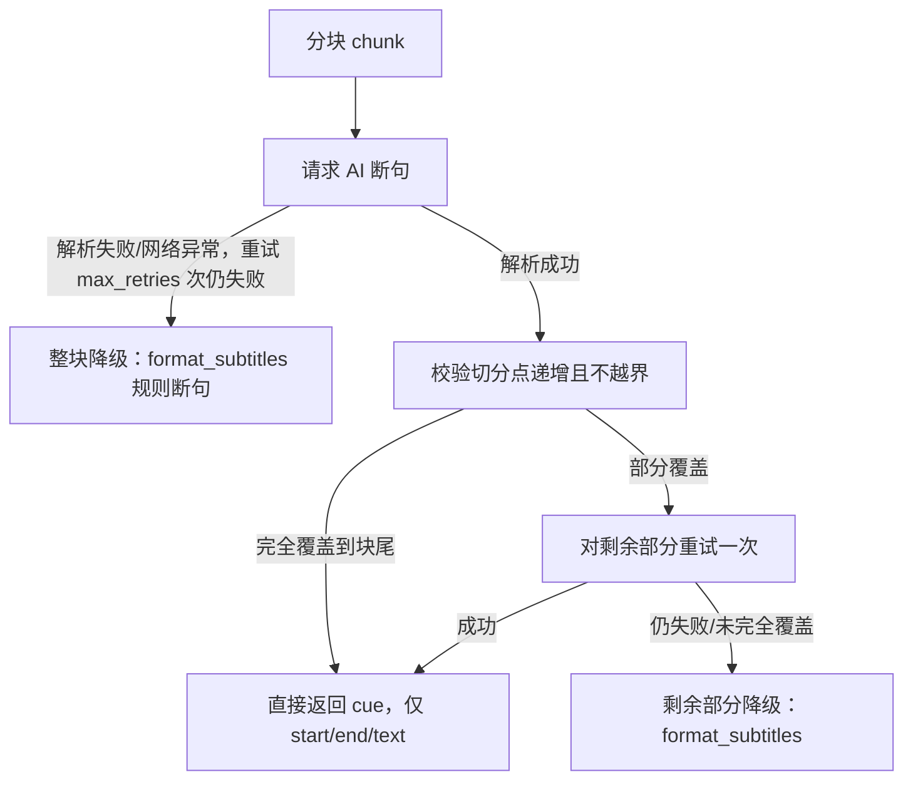

# AI 断句模式：设计与实现

## 背景

[docs/subtitle-segment-analysis.md](./subtitle-segment-analysis.md) 分析了现有规则断句（[app/subtitle/segment.py](../app/subtitle/segment.py)）的固有短板，核心是：**规则断句依赖标点/静音/词数等表层信号，无法理解语义**。其中影响面最大的是 YouTube 自动生成（ASR）字幕通常没有标点，导致断句几乎只能靠静音时长和硬性词数上限，容易在语义中间生硬切分。

对比调研了 kiss-translator（`D:\fork\kiss-translator`）的 AI 字幕断句实现（`src/subtitle/youtubeAiSegmentation.js` + `src/config/api.js` 的 `defaultSubtitlePrompt`），结论：**规则断句应保留为默认/兜底路径（零成本、确定性、无需联网），但可以引入一个可选的 AI 断句模式，专门解决语义理解类的短板**。

实现分两个阶段：第一版把断句和翻译合并成一次请求（模型同时返回原文+译文），实测发现 token 消耗和耗时都远超预期；第二版（当前版本）把协议瘦身为"只让模型返回切分点"，翻译交还给已有的批量翻译流程，大幅降低了成本和延迟。下面记录的是当前版本的设计。

## 核心设计

### 1. 协议：只要切分点，不要模型复述原文/给译文

时间戳和原文永远由本模块基于原始词级 `flat_events` 重建，**不信任模型自己报告的时间或文本，也不需要模型输出文本**。模型只需要回答"在哪些词 id 处结束一个片段"：

```json
[8, 14, 22, 33]
```

`8` 表示第一个片段覆盖 id `0-8`，`14` 表示第二个片段覆盖 `9-14`，以此类推——单次请求的生成量从"整段原文+译文"降到几个整数，token 和耗时大幅下降。

第一版协议（`{"e","o","t"}`，模型要复述原文并顺带给译文）已废弃，原因见下面的"迭代记录"。

### 2. 结构校验 + 自动降级，失败上限就是现状

每个分块的处理流程（`_process_chunk`）：



校验规则（`_build_cues_from_cutpoints`）：切分点必须从上一段 `+1` 开始、严格递增、不越界；只要有一步失败，就在该点截断，剩余部分自动走现有规则断句兜底，**永远不会比现在的规则断句结果更差**。

不再做"模型复述原文是否逐字一致"的内容校验——这是用可靠性换速度的权衡，见下方"已知限制"。

**重试策略（v2.1 优化）**：`temperature=0` 的确定性模型下，解析失败/未覆盖块尾后重试结果基本不变，纯浪费请求，因此：

- **解析失败（格式非法）不重试**，立即返回 `None` 整块降级规则断句；
- **网络/接口异常**保留重试，按 `1s/2s/4s` 指数退避，最多 `max_retries` 次；
- **尾部补试**（切分点未覆盖到块尾时对剩余部分再请求一次）改为默认关闭，由 `tail_retry=None` 时按 `temperature > 0` 自动开启；显式传 `tail_retry=True` 可强制开启。

### 3. 分块策略复用现有断句信号

`chunk_events` 按目标字符数（默认 **2000**，v2.2 从 3000 下调，见迭代记录 6）分块，达到 80% 预期边界后，优先在句末标点（复用 `segment.py` 的 `_END_OF_SENTENCE_RE`）或静音 >1s 处切，减少语义被硬切在分块边界的概率。

### 4. 翻译解耦：统一交给已有的批量翻译

AI 断句的返回结果只有 `{start, end, text}`，不含译文。调用方（server.py / cli.py）无需再区分"AI 已翻译/待翻译"两种 cue，直接对全部结果统一跑一次：

```python
cues = ai_format_subtitles(...) if ai_segment else format_subtitles(...)
if translate:
    translate_cues(cues, ...)
```

这比第一版更简单：不再需要过滤 `"translation" not in c`，代码路径和"不开 AI 断句"时完全一致。

### 5. 并发与复用

- `ai_format_subtitles` 分块之间互不依赖，用 `ThreadPoolExecutor + as_completed` 并发处理（默认 `concurrency=8`，复用 [app/tts.py](../app/tts.py) 已验证过的模式）；`translate_cues` 同样加了 `concurrency`（默认 4）。
- 重构 [app/translate.py](../app/translate.py) 抽出 `resolve_call_llm` 工厂，AI 断句与 `translate_cues` 共用同一份 HTTP 请求实现。JSON 解析也复用 `translate.py` 里已有的 `_strip_code_fence` / `_try_json_array`。

## 模块结构

[app/subtitle/ai_segment.py](../app/subtitle/ai_segment.py)：

| 函数                         | 职责                                                            |
| ---------------------------- | --------------------------------------------------------------- |
| `chunk_events`               | 按字符数分块，优先在句末标点/静音处切                           |
| `build_indexed_events`       | 词级事件 → `[{"id","text","pauseMs"?}]`                         |
| `build_ai_segment_messages`  | 按源语言是否无空格（CJK 等）选用不同长度限制规则                |
| `parse_ai_segments`          | 解析模型响应为切分点整数数组，格式不对返回 `None`               |
| `_build_cues_from_cutpoints` | 校验切分点递增/不越界，产出验证通过的 cue 与覆盖终点            |
| `_process_chunk`             | 单分块处理：请求 → 校验 → 未覆盖部分尾部重试一次 → 规则断句兜底 |
| `ai_format_subtitles`        | 主入口：并发处理各分块 → 按原始顺序拼接结果                     |

`app/subtitle/__init__.py` 导出 `ai_format_subtitles`。

## 接入点（默认关闭，opt-in）

- **[server.py](../app/server.py)**：`PrepareRequest.ai_segment: bool = False`，仅 `translate=True` 时生效；`ai_format_subtitles` 抛 `ValueError`（缺 API Key）时捕获并整体降级为规则断句。
- **[cli.py](../app/cli.py)**：新增 `--ai-segment`，仅 `translated`/`bilingual` 模式下生效，同样捕获 `ValueError` 后降级而不是直接报错退出。
- **前端**（[web/index.html](../web/index.html) / [web/app.js](../web/app.js)）：新增"AI 智能断句"开关，**默认不勾选**（kiss-translator 的同类功能 `segSlug` 默认也是 `"-"` 关闭状态，且它是按播放位置懒加载处理，不像本项目要一次性处理全量视频，默认开着成本明显更高）；未勾选"翻译成中文"时该开关自动禁用并取消勾选。

## 测试

[tests/test_ai_segment.py](../tests/test_ai_segment.py)，沿用 `translate.py` 测试里"注入假 `call_llm`"的模式，覆盖：

- `chunk_events`：字符数硬切、句末标点提前切块。
- `build_indexed_events`：`pauseMs` 计算。
- `build_ai_segment_messages`：空格/无空格语言的长度规则。
- `parse_ai_segments`：合法解析、去 markdown 围栏、整数浮点数容错、非法格式拒绝。
- `ai_format_subtitles` 端到端：完全成功（无 translation 字段）、无空格语言拼接方式、整体解析失败降级、切分点越界降级、部分覆盖+尾部重试成功、部分覆盖+尾部重试仍失败（仅剩余部分降级）、temperature=0 跳过尾部重试、网络异常退避重试、逐块进度回调。
- [tests/test_server.py](../tests/test_server.py)：缓存感知断句方式——切换 `ai_segment` 开关不命中旧缓存（复用视频重新断句）、同设置重复请求命中 AI 断句缓存。

全部 85 个测试通过。

## 迭代记录

1. **第一版（`{"e","o","t"}` 合并断句+翻译）**：实测发现该协议要求模型把原文再复述一遍到 `"o"` 字段用于逐字校验，单次请求的生成量接近纯翻译的 2 倍，导致 token 消耗和耗时都远超预期（用户实测反馈"AI 断句非常慢""token 消耗剧增"）。
2. **对比 kiss-translator 真实用法**：发现它的 AI 断句默认关闭（`segSlug: "-"`），且是按 `preTrans`（默认 90 秒）懒加载处理用户实际观看到的位置，从不会一次性处理整段视频——这是它实际使用中 token 消耗低的真正原因，而不是协议本身更省。yt-localizer 是离线批处理工具，必须一次性处理全量视频，天然无法复用这种"按需处理"的省钱方式。
3. **修复了 cli.py 与 server.py 行为不一致的 bug**：`ai_format_subtitles` 抛 `ValueError` 时 cli.py 原本直接 `return 3` 退出，未按承诺降级为规则断句，已修正为与 server.py 一致。
4. **第二版（当前，纯切分点协议）**：去掉 `"o"`/`"t"`，只留切分点，翻译解耦给 `translate_cues` 统一处理，显著降低单次请求的生成量。同时把并发度从 4 提到 8、`max_chunk_chars` 从 1000 提到 3000，进一步压缩总请求数与墙钟时间。
5. **v2.1 重试策略瘦身**：实测反馈 AI 断句仍偏慢，分析出最大浪费点是 `temperature=0` 下的无效重试（解析失败重试、未覆盖块尾的尾部补试，结果基本不变）。改为解析失败不重试、网络异常指数退避重试、尾部补试默认关闭（`temperature>0` 时自动开启），把"必然失败的重复请求"从慢路径里去掉。
6. **v2.2 降低单请求延迟**：非流式请求的耗时主要来自输入处理（TTFT），因此双管齐下压低单请求输入量——精简 `_PROMPT_TEMPLATE`（压缩措辞、示例从 15 词缩到 5 词，system prompt 约省 35%，每个 chunk 都重复发送所以收益线性放大），并把 `max_chunk_chars` 默认从 3000 调到 2000（更小分块、更快单请求，并发 8 摊平请求数增量）。两项都是实验性调整，可用真实视频实测后继续微调甜点。
7. **v2.3 缓存感知断句方式**：AI 断句结果本就随 manifest 缓存（重复运行同设置请求直接命中），但 manifest 此前不记录"结果是用规则还是 AI 断句生成的"，导致切换 `ai_segment` 开关/模型后仍命中旧缓存、开关失效。现 manifest 增加 `ai_segment`/`ai_model` 字段，缓存命中条件校验断句方式与模型一致；不匹配时复用已下载视频（跳过下载），仅重新拉字幕 + 断句 + 翻译。
8. **v2.4 修复翻译超时降级**：用户实测反馈"字幕没翻译成中文"。排查发现是翻译请求超时——翻译一批（~40 条/≤1500 字符）实测需 **70~146 秒**，而 `translate_cues` 默认 `timeout=60` 秒，第一批请求必然超时，`translate_batch` 重试 3 次仍失败后**整批降级返回原文**（manifest 中表现为前 31 条 `translation==text`，恰好是第一批）。修复：`translate_cues`/`resolve_call_llm`/`ai_format_subtitles` 的 `timeout` 默认 60 → **180 秒**。教训：翻译请求输出量大（每批几十条译文），生成耗时远超 AI 断句（只输出整数），不能共用 60 秒的心理预期。
9. **v2.5 兼容模型偶发返回对象数组**：用户实测反馈部分字幕的 translation 值形如 `"{'translate': '...'}"`。根因：prompt 要求模型输出"纯字符串数组"，但模型偶发返回对象数组 `[{"translate": "..."}, ...]`；旧 `parse_translation_response` 用 `str(item)` 转字符串，Python 字典被转成 repr 文本直接存进 translation。修复：解析时兼容 `{"translate"/"translation"/"t": ...}` 对象数组，提取键值；对象里无可用键则返回 `None` 触发重试。同时把已产生的坏缓存数据（26 条）用 `ast.literal_eval` 还原修复。

## 已知限制

1. **断句方式切换后需重新拉字幕**：manifest 不缓存词级 `flat_events`，切换 `ai_segment`/模型后需重新 `fetch_subtitle`（轻量网络请求）才能重建词级流再断句；视频文件本身会复用，不会重新下载。
2. **不再做原文内容校验**：第二版协议不要求模型复述原文，因此无法再检测"模型切分点是否真的对应它想要的边界"（比如少切/多切一个词的轻微偏差），只能做结构校验（递增、不越界、覆盖到底）。这是用可靠性换取大幅降本增速的权衡，出现的偏差通常是"差一两个词"级别，不会像协议不合法那样整段降级。
3. **默认关闭尾部补试**：`temperature=0` 下切分点未覆盖块尾时不再对剩余部分补发一次请求，直接规则断句降级——省掉必然无效的请求，代价是该 chunk 的尾部质量回落到规则断句水平；如需保留补试，显式传 `tail_retry=True` 或调高 `temperature`。
4. **翻译批次失败静默降级为原文**：`translate_batch` 全败时整批保留原文，且不向外报告，manifest 仍标记 `translated: True`，用户不易察觉。v2.4 提高 timeout 后正常路径不再触发；若网络长期不稳，仍可能出现局部未翻译（SRT 里个别行是原文）。
